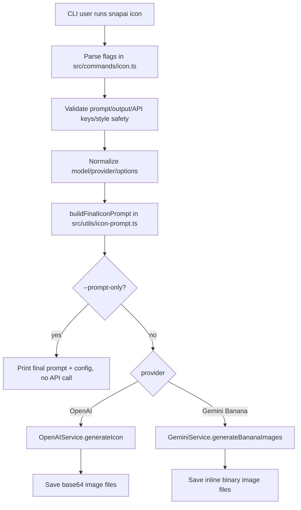

# SnapAI Prompt + Logo Generation Analysis

Date: 2026-05-01  
Scope: prompt construction and provider request flow for `snapai icon`, with special attention to what happens when users ask for “logo” output.

## Executive summary

SnapAI does not currently have a dedicated “logo generator” mode. The active command is `snapai icon`, and its default prompt enhancer intentionally steers models toward **standalone square symbol/subject illustrations** rather than app launcher tiles, logo plates, badges, typography, monograms, or brand-like marks.

Important implications:

- A user prompt like `--prompt "logo"` is treated as the **subject text** inside a broader icon-art prompt.
- In enhanced mode, SnapAI explicitly says: **do not design or imply an app icon, logo plate, badge, or rounded-square container**, even if the user mentions “logo”.
- The generated output is therefore more likely to be a **symbolic illustration/mark-like subject** than a traditional logo or wordmark.
- Text and typography are explicitly forbidden in enhanced mode, so wordmarks and letter-based logos are suppressed.
- To generate a true logo-style asset, the user must use `--raw-prompt`, optionally with a `--style` directive, because raw mode bypasses SnapAI’s anti-logo/app-icon constraints.

Primary files analyzed:

- `src/commands/icon.ts`
- `src/utils/icon-prompt.ts`
- `src/utils/styleTemplates.ts`
- `src/services/openai.ts`
- `src/services/gemini.ts`
- `src/utils/prompts.ts`
- `src/utils/validation.ts`
- `README.md`

---

## High-level generation pipeline



The most important point: **the final prompt is built once in `IconCommand` and passed unchanged to either OpenAI or Gemini.** Provider selection changes API parameters, model ID, quality, image count, etc., but not the core prompt language.

---

## Active prompt builder

The active prompt builder is:

```ts
buildFinalIconPrompt({
  prompt: flags.prompt,
  rawPrompt: flags["raw-prompt"],
  style: flags.style,
  useIconWords: flags["use-icon-words"],
});
```

Source: `src/commands/icon.ts` and `src/utils/icon-prompt.ts`.

### Inputs to `buildFinalIconPrompt`

| Parameter | Source flag | Default | Meaning |
|---|---:|---:|---|
| `prompt` | `--prompt`, `-p` | required | User’s concept/subject. Max length is 1000 characters. |
| `rawPrompt` | `--raw-prompt`, `-r` | `false` | If true, bypasses SnapAI enhancement unless `--style` is also provided. |
| `style` | `--style`, `-s` | undefined | Either a known style preset or custom free-form style text. |
| `useIconWords` | `--use-icon-words`, `-i` | `false` | Adds “icon-style” wording to the generated prompt. README notes this may increase padding. |

---

## Prompt modes

### 1. Enhanced mode, no style

Default command:

```bash
snapai icon --prompt "finance app secure lock"
```

Behavior:

- Uses SnapAI’s full prompt enhancer.
- Produces a multi-layer prompt with:
  - fixed size: `1024x1024`
  - subject line
  - anti-container / anti-logo-plate rules
  - archetype selection instructions
  - concept and creativity guidance
  - material, composition, lighting, and QA rules
- If no glossy keywords are present, default matte/clean-illustration guardrails are enabled.

### 2. Enhanced mode with preset style

Example:

```bash
snapai icon --prompt "music player" --style glassy
```

Behavior:

- The style is matched against `StyleTemplates.getAvailableStyles()`.
- If matched, it becomes a **dominant hard constraint**.
- The style directive is injected twice:
  1. early in layer 1 before `Material:`
  2. later in the `Style system:` block
- The prompt says that if any instruction conflicts, the style rules win.

### 3. Enhanced mode with custom style text

Example:

```bash
snapai icon --prompt "weather app" --style "soft paper cutout"
```

Behavior:

- Since the style is not a known preset, it is treated as free-form style text.
- It is appended as:

```text
Style: soft paper cutout
```

- The prompt says custom styles affect material/rendering, not archetype selection.

### 4. Raw mode, no style

Example:

```bash
snapai icon --prompt "minimal logo mark for a coffee shop" --raw-prompt
```

Behavior:

- Sends exactly the user’s prompt to the model.
- No SnapAI anti-logo, anti-text, anti-container, size-language, archetype, or QA rules are added.
- This is the only current path that lets a user request traditional logos without SnapAI’s default suppression.

### 5. Raw mode with preset style

Example:

```bash
snapai icon --prompt "minimal logo mark for a coffee shop" --raw-prompt --style minimalism
```

Generated prompt structure:

```text
STYLE PRESET (dominant): minimalism
Style directive (must dominate all decisions): <inline minimalism directive>

User prompt: minimal logo mark for a coffee shop
```

Behavior:

- Raw prompt is no longer literally the only text, because style is added.
- SnapAI still does **not** add its broader icon constraints.
- The style preset becomes dominant.

### 6. Raw mode with custom style text

Example:

```bash
snapai icon --prompt "logo for a coffee shop" --raw-prompt --style "flat vector, black and cream"
```

Generated prompt structure:

```text
STYLE (dominant): flat vector, black and cream

User prompt: logo for a coffee shop
```

---

## Default enhanced prompt anatomy

In non-raw mode, `buildFinalIconPrompt` composes the final prompt from three conceptual layers.

### Layer 1: concept and art direction

Starts with:

```text
Create a 1024x1024 square symbol illustration.

Subject: <user prompt>
```

If `--use-icon-words` is enabled, the first line changes to:

```text
Create a 1024x1024 square symbol illustration (icon-style, but not an app launcher tile).
```

Then SnapAI injects a context block designed to avoid common unwanted results:

- standalone symbol/illustration, not an app launcher icon or UI mockup
- no app icon, logo plate, badge, or rounded-square container
- no margins/padding/card background
- square canvas with sharp 90° corners
- no global shadows/glows/halos
- no UI mockups, borders, frames, stickers, app plates, or device chrome
- no text/typography/monograms/watermarks
- no photo/portrait/real-world scene
- no realistic human faces as main subject
- no copying real brand logos or trademarked marks

This is the central reason logo generation is constrained by default.

### Layer 1 archetype system

The prompt instructs the model to choose exactly one internal archetype:

| Archetype | Intended usage |
|---|---|
| `object_icon` | A single object or symbol without a face/personality. Best for finance, productivity, utilities, dev tools, dashboards, system apps. |
| `abstract_form_icon` | Pure form/metaphor. Best for AI tools, design tools, analytics, experimental products. |
| `hybrid_icon` | Object with subtle life cues, no face. Friendly but restrained. |
| `character_icon` | Friendly expressive character with a face. For kids, games, beginner education, wellness, fun social. Never the default. |

Logo relevance: this pushes the model away from generic logos and toward a single representational symbol/illustration.

### Layer 1 concept guidance

The prompt asks for:

- one intentional visual element representing the app
- not generic logos or generic symbols
- not the most literal/obvious metaphor
- a clear but slightly unexpected metaphor
- creativity through material, metaphor, lighting, proportions, and texture
- not always adding eyes/faces or making objects cute

This means the project is opinionated toward “creative app artwork” rather than corporate identity/logo design.

### Layer 1 material and lighting

The material/lighting section changes depending on whether SnapAI thinks the user is asking for the default look.

`isDefaultLook` is true when:

```ts
!style && !glossyKeywords.test(prompt)
```

Glossy keywords include:

```text
glassy, glass, chrome, holographic, iridescent, neon, glow, bloom,
sparkle, sparkles, lens flare, shiny, shine, metallic
```

If default look is true, SnapAI asks for:

- matte finish
- painted polymer, ceramic, paper, or flat vector
- no glass/chrome/neon unless requested
- soft controlled lighting
- minimal specular highlights
- no bloom/glow/lens flares
- no “3D glass icon” look

If default look is false, SnapAI allows a dominant material such as glass, metal, gel, ceramic, plastic, light, fabric, or liquid.

### Layer 2: technical constraints and QA

Layer 2 adds hard constraints:

- square 1:1 aspect ratio
- subject fills 92–98% of canvas
- centered/balanced silhouette
- critical details within safe area
- Android-safe central detail region
- background reaches all four square edges
- if multiple images, keep archetype and material consistent
- reject photo/portrait/full scene/mascot-by-default/too many elements/unauthorized face/card/tile background
- accept small-size readability, strong silhouette, intentional material, clean contrast
- QA: blur test at ~64px, wallpaper contrast, one focal point

### Layer 3: optional style system

If `--style` is present, layer 3 enforces it.

Preset style:

```text
Style system:
This preset is the base art direction and is a HARD constraint. If any other instruction conflicts, the style rules win. Concept, material, lighting, composition, and rendering must all comply with it.
Primary style preset (dominant): <preset>
Style intent: <summary>
Style directive (must dominate all decisions): <inline directive>
Do not mix in other conflicting materials/styles.
```

Custom style:

```text
Style system:
Apply the style after the concept is defined. Styles affect material and rendering (texture/color/lighting), not the chosen archetype.
Style: <custom style text>
```

---

## How “logo” requests are handled

### Default enhanced mode

Command:

```bash
snapai icon --prompt "logo"
```

The model receives a prompt that includes:

```text
Subject: logo
```

But it also receives constraints such as:

```text
Do not design or imply an app icon, logo plate, badge, or rounded-square container, even if the user prompt mentions "app icon", "logo", "badge", or similar terms.
No text/typography (letters, numbers, monograms). No watermark.
Do not copy or imitate real brand logos, trademarked shapes, or recognizable brand marks.
Avoid generic logos and generic symbols.
```

Resulting behavior:

- The word “logo” becomes a weak subject cue.
- SnapAI strongly discourages logo plates, text, monograms, and recognizable brand marks.
- The likely output is a symbol-like illustration, not a conventional logo.

### Raw mode

Command:

```bash
snapai icon --prompt "logo for a coffee brand, black vector mark, no text" --raw-prompt
```

The model receives exactly:

```text
logo for a coffee brand, black vector mark, no text
```

Resulting behavior:

- SnapAI does not suppress logo generation.
- Provider-level safety policies still apply.
- The output is still requested through a square image generation API, but prompt-wise this is the real logo path.

### `--use-icon-words` mode

Command:

```bash
snapai icon --prompt "coffee logo" --use-icon-words
```

Only this phrase changes:

```text
square symbol illustration
```

into:

```text
square symbol illustration (icon-style, but not an app launcher tile)
```

This does **not** enable logos. It merely uses icon-oriented wording while still saying not to create app launcher tiles. The flag exists because the project tries to avoid the words “icon” and “logo” by default; README notes those words can increase unwanted padding/framing.

---

## Style preset system

The known style presets are defined in `src/utils/styleTemplates.ts`:

```text
minimalism, glassy, woven, geometric, neon, gradient, flat, material,
ios-classic, android-material, pixel, game, clay, holographic, kawaii, cute
```

Each style definition can include:

| Field | Purpose |
|---|---|
| `id` | CLI-facing preset key. |
| `systemName` | Uppercase name inserted into prompt directives. |
| `summary` | Human-readable description shown in previews/docs and used as style intent. |
| `culturalDna` | Reference traditions or design movements. |
| `description` | Short model-facing explanation. |
| `visualTraits` | Structured visual properties. |
| `mandatory` | Required traits. |
| `forbidden` | Things the model must avoid. |
| `avoid` | Softer avoidance guidance. |
| `checklist` | Internal checklist questions. |
| `includeBaseRules` | Whether standalone style prompts should include global base rules. |

### Style directive format

For active generation through `buildFinalIconPrompt`, style presets use the **inline** style block, e.g.:

```text
Style system: MINIMALISM. Cultural DNA: Swiss design, Apple, Braun, Dieter Rams, Functionalism. Description: Extreme reduction focused on clarity and function. Visual traits: max 3 colors; simple primary silhouettes; large negative space; textures: false; effects: false. Mandatory: Must be readable at very small sizes, Must work in monochrome, Single dominant symbol. Forbidden: Gradients, Shadows, 3D effects, Decorative details, Textures. Avoid: Over-design, Complex metaphors, Visual noise. Checklist: Can it be drawn in under 5 strokes? Is it clear without color? Is it recognizable at 24px?
```

### Presets most relevant to logo-like output

| Preset | Logo usefulness | Notes |
|---|---|---|
| `minimalism` | High for simple logo marks | Forbids gradients, shadows, 3D, decorative detail, textures. Good for clean marks, but enhanced mode still bans text/monograms. |
| `flat` | High for vector-like symbols | Solid colors, no depth, no gradients/effects. |
| `geometric` | High for abstract marks | Bauhaus/grid/math style. Good for abstract forms. |
| `gradient` | Medium | Modern app/social style; not necessarily classic logo design. |
| `material` / `android-material` | Medium | More app-icon-like/product UI than brand identity. |
| `glassy`, `neon`, `holographic` | Low-to-medium | Strong effects may create trendy icon art rather than flexible logo marks. |
| `pixel`, `game`, `kawaii`, `cute`, `clay`, `woven` | Niche | Useful for stylized brands, less for general logos. |

### Notable style interaction issue

`buildStylePrompt()` and `includeBaseRules` exist in `StyleTemplates`, but the active `IconCommand` path does **not** call `StyleTemplates.getStylePrompt()`. It calls only `getStyleDescription()` and `getStyleDirective()` through `buildFinalIconPrompt()`.

Therefore, `includeBaseRules: false` currently affects `getStylePrompt()`, but not the main CLI prompt path. In the active path, global enhanced prompt constraints are still present for non-raw mode even for styles like `ios-classic` and `pixel`.

---

## Provider-specific request behavior

### OpenAI

OpenAI generation occurs in `src/services/openai.ts`.

SnapAI maps CLI aliases to OpenAI model IDs:

| CLI model | Provider model |
|---|---|
| `gpt-1.5` | `gpt-image-1.5` |
| `gpt-1` | `gpt-image-1` |
| `gpt-image-2` | `gpt-image-2` |
| `gpt` | normalized earlier to `gpt-1.5` |

Request fields:

| Request field | Source |
|---|---|
| `model` | Resolved OpenAI model ID. |
| `prompt` | Final prompt from `buildFinalIconPrompt`. |
| `n` | `--n` or deprecated `--num-images`. Range 1–10. |
| `size` | Always `1024x1024`. |
| `quality` | `auto`, `high`, `medium`, `low`; CLI aliases `hd → high`, `standard → medium`. |
| `background` | `transparent`, `opaque`, or `auto`. `transparent` rejected for `gpt-image-2`. |
| `output_format` | `png`, `jpeg`, or `webp`. |
| `moderation` | `low` or `auto`. |

Logo relevance:

- OpenAI supports `--background transparent` for `gpt-1.5` / `gpt-1`, which is useful for logo-like assets.
- `gpt-image-2` rejects transparent backgrounds.
- The service-level `rawPrompt` option is effectively a no-op because `const finalPrompt = rawPrompt ? prompt : prompt;` returns `prompt` either way. The actual raw/enhanced distinction happens earlier in `buildFinalIconPrompt()`.

### Gemini / Nano Banana

Gemini generation occurs in `src/services/gemini.ts`.

Model mapping:

| CLI mode | Provider model | Notes |
|---|---|---|
| `--model banana` | `gemini-2.5-flash-image` | Normal mode, always 1 image. |
| `--model banana --pro` | `gemini-3-pro-image-preview` | Supports quality tiers and multiple images. |
| `--model banana-2` | `gemini-3.1-flash-image-preview` | 1 image, 1K, optional thinking level. |

Gemini request shape:

```ts
contents = [
  {
    role: "user",
    parts: [{ text: prompt }],
  },
]
```

Config:

- always requests `responseModalities: ["IMAGE", "TEXT"]`
- Banana Pro maps `--quality 1k|2k|4k` to `imageConfig.imageSize: "1K" | "2K" | "4K"`
- Banana 2 uses `imageConfig.imageSize: "1K"`
- Banana 2 maps thinking:
  - `--thinking minimal` → `MINIMAL`
  - `--thinking max` → `HIGH`
  - default → `MINIMAL`

Logo relevance:

- Gemini gets the same final prompt text as OpenAI.
- There are no Gemini-specific logo instructions.
- Normal Banana cannot generate multiple variations; Banana Pro can.

---

## Validation and safety filters affecting prompts

### Prompt validation

`ValidationService.validatePrompt()` enforces:

- prompt must not be empty
- prompt length must be <= 1000 characters

No semantic prompt validation exists for logo terms.

### Dangerous style filter

`isStyleDangerous()` in `src/commands/icon.ts` blocks style strings containing photo/portrait/camera-realism terms such as:

```text
photo, photograph, photoreal, photorealistic, portrait, headshot,
selfie, concert, wedding, dslr, 35mm, cinematic still,
real person, celebrity
```

This only applies to `--style`, not `--prompt`.

Logo relevance:

- Users can say `--prompt "photorealistic logo on a sign"`; this is not blocked at validation level.
- But in enhanced mode, prompt constraints still reject photo/full-scene behavior.
- Users cannot set `--style photorealistic` because that is blocked.

---

## Legacy / currently unused prompt utilities

`src/utils/prompts.ts` defines `PromptTemplates` with methods such as:

- `enhanceForIOSIcon(userPrompt)`
- `enhanceForAndroidIcon(userPrompt)`
- `getSuccessfulPromptElements()`
- `getPopularExamples()`
- `addGlassEffects(prompt)`
- `addPastelColors(prompt)`

These appear to be older utilities. The active CLI path imports `buildFinalIconPrompt` from `src/utils/icon-prompt.ts`, not `PromptTemplates`.

Meaning:

- `PromptTemplates.enhanceForIOSIcon()` and `enhanceForAndroidIcon()` do not currently affect generated prompts.
- The older templates share the same overall philosophy: square illustration, no app launcher icon/tile/card, no text/UI, clean background.
- They are useful historical context but not the current source of truth.

---

## Concrete prompt examples

### Example A: enhanced “logo” request

Command:

```bash
snapai icon --prompt "coffee shop logo"
```

Prompt characteristics:

```text
Create a 1024x1024 square symbol illustration.

Subject: coffee shop logo

Context: standalone symbol/illustration for general use, not an app launcher icon or UI mockup.
Do not design or imply an app icon, logo plate, badge, or rounded-square container, even if the user prompt mentions "app icon", "logo", "badge", or similar terms.
...
No text/typography (letters, numbers, monograms). No watermark.
...
Avoid generic logos and generic symbols. Avoid the most literal/obvious metaphor; choose a clear but slightly unexpected metaphor.
```

Expected tendency:

- likely a coffee-related standalone symbol/illustration
- unlikely to include readable text
- unlikely to include a classic logo lockup
- unlikely to include a rounded square app tile

### Example B: raw true logo request

Command:

```bash
snapai icon --prompt "coffee shop logo, simple black vector mark, no text, transparent background" --raw-prompt --model gpt-1.5 --background transparent
```

Prompt sent:

```text
coffee shop logo, simple black vector mark, no text, transparent background
```

Expected tendency:

- more logo-like
- less SnapAI-controlled
- transparent output possible on compatible OpenAI models

### Example C: raw logo request with a preset

Command:

```bash
snapai icon --prompt "coffee shop logo mark" --raw-prompt --style minimalism
```

Prompt sent:

```text
STYLE PRESET (dominant): minimalism
Style directive (must dominate all decisions): Style system: MINIMALISM. Cultural DNA: Swiss design, Apple, Braun, Dieter Rams, Functionalism. Description: Extreme reduction focused on clarity and function. Visual traits: max 3 colors; simple primary silhouettes; large negative space; textures: false; effects: false. Mandatory: Must be readable at very small sizes, Must work in monochrome, Single dominant symbol. Forbidden: Gradients, Shadows, 3D effects, Decorative details, Textures. Avoid: Over-design, Complex metaphors, Visual noise. Checklist: Can it be drawn in under 5 strokes? Is it clear without color? Is it recognizable at 24px?

User prompt: coffee shop logo mark
```

Expected tendency:

- more controlled and brand-mark-like than default enhanced mode
- no general SnapAI prohibition against logo/text, except what the style itself implies

---

## Variables that materially change image output

| Variable / flag | Changes prompt text? | Changes API config? | Notes |
|---|---:|---:|---|
| `--prompt` | Yes | No | Main subject/concept. In enhanced mode, it is embedded as `Subject: ...`. |
| `--raw-prompt` | Yes | Indirect | Switches from full enhancer to raw/custom style wrapper. |
| `--style` | Yes | No | Preset or custom style. Presets dominate conflicts. |
| `--use-icon-words` | Yes | No | Adds “icon-style” language. Can increase icon framing/padding. |
| `--model` | No | Yes | Selects OpenAI vs Gemini and concrete model. |
| `--quality` | No | Yes | OpenAI quality or Banana Pro image size. |
| `--background` | No | Yes | OpenAI only; important for transparent logo assets. |
| `--output-format` | No | Yes | OpenAI only. |
| `--n` | Prompt contains multiple-image consistency rule regardless; no per-n prompt content | Yes | OpenAI and Banana Pro can generate multiple images. |
| `--moderation` | No | Yes | OpenAI only. |
| `--pro` | No | Yes | Gemini Banana Pro model selection. |
| `--thinking` | No | Yes | Banana 2 thinking config only. |
| `--prompt-only` | No | No generation | Prints final prompt/config for inspection. |

---

## Prompt strategy observations

### Strengths

1. **Strong prevention of common app-icon failures**  
   The prompt repeatedly prevents rounded-square plates, badge containers, device chrome, text, and excessive padding.

2. **Good small-size readability guidance**  
   It explicitly asks for a strong silhouette, one focal point, 64px blur test, wallpaper contrast, and high canvas occupancy.

3. **Explicit anti-brand-copy guardrail**  
   “Do not copy or imitate real brand logos...” is important for trademark safety.

4. **Archetype framework is useful**  
   Object/abstract/hybrid/character categories give the model a conceptual decision tree.

5. **Style system is structured**  
   Styles are not just adjectives; they include mandatory, forbidden, avoid, visual traits, and checklists.

6. **Prompt preview is excellent for debugging**  
   `--prompt-only` makes the final prompt visible without spending API credits.

### Weaknesses / inconsistencies

1. **The project says app icons, but the active prompt says not app launcher icons**  
   The CLI/README positions SnapAI as app-icon oriented, while the prompt deliberately avoids app launcher icon layouts and rounded-square masks. This is likely intentional to avoid padded tiles, but the wording can be confusing.

2. **No true logo mode**  
   Users can type “logo”, and README includes a “logo mark” example, but enhanced mode fights traditional logo features like text, monograms, and logo plates.

3. **`rawPrompt` in `OpenAIService` is redundant**  
   The service computes `const finalPrompt = rawPrompt ? prompt : prompt;`, so the flag has no service-level effect.

4. **Legacy `PromptTemplates` appear unused**  
   Older iOS/Android enhancement helpers are not wired into the current command path.

5. **`includeBaseRules` does not affect main CLI path**  
   Some style definitions set `includeBaseRules: false`, but the active prompt builder still uses global constraints in enhanced mode.

6. **Text is globally forbidden in enhanced mode**  
   This is good for app icons but incompatible with many logo use cases, especially wordmarks, monograms, and lettermarks.

7. **The term `use-icon-words` description mentions logo**  
   The flag says it includes words “icon” / “logo”, but the actual prompt only adds “icon-style”; it does not add “logo”.

---

## Recommendations if the project wants better logo generation

### Add a dedicated `--mode logo` or `snapai logo` command

A logo mode should not reuse the current icon enhancer unchanged. It should have its own constraints:

- allow logo marks, wordmarks, monograms, and lockups depending on user intent
- forbid copying real brands/trademarks
- optionally allow transparent background by default when compatible
- use vector/flat/simple shape language
- ask for scalability, small-size readability, and black/white viability
- avoid mockups, business cards, signage, and 3D scenes unless requested

### Suggested logo prompt skeleton

```text
Create a clean, original logo concept for: <user prompt>.
Logo type: <mark | wordmark | monogram | combination mark | emblem>.
Style: <style or default brand style>.

Requirements:
- Original, non-infringing design; do not imitate existing brands or trademarked marks.
- Simple, scalable, high-contrast silhouette.
- Works at small sizes and in one color.
- No mockups, no business cards, no signage, no realistic scene.
- Transparent or plain background if supported.
- If text is requested, keep it minimal and legible; otherwise no text.
```

### Add logo-specific flags

Potential flags:

| Flag | Purpose |
|---|---|
| `--logo-type mark|wordmark|monogram|combination|emblem` | Controls whether text/letters are allowed. |
| `--brand-name` | Explicit text for wordmarks/combination marks. |
| `--no-text` | Default for logo marks. |
| `--transparent` | Alias for OpenAI transparent background where supported. |
| `--palette` | Brand color control. |
| `--industry` | Helps choose metaphors without overloading `--prompt`. |

### Keep raw mode for power users

Even with a logo mode, `--raw-prompt` should remain available because many users will want direct model control.

---

## Bottom line

SnapAI’s current prompt system is highly optimized for **square app artwork / icon-like subject illustrations**, not traditional logo generation. When the user asks for a “logo” in normal enhanced mode, the prompt deliberately neutralizes many logo behaviors: no logo plate, no text, no monograms, no brand imitation, no generic logos, no rounded-square containers.

For logo-like output today, users should use:

```bash
snapai icon --prompt "simple original logo mark for <brand>, vector style, no text" --raw-prompt --model gpt-1.5 --background transparent
```

For first-class logo generation, the project would benefit from a dedicated logo prompt path instead of routing logo requests through the current app-icon/artwork enhancer.

---

## Addendum: exact prompt captures from calling `buildFinalIconPrompt()`

I compiled the pure prompt modules:

```bash
tsc src/utils/icon-prompt.ts src/utils/styleTemplates.ts \
  --outDir /tmp/snapai-prompt \
  --module NodeNext \
  --moduleResolution NodeNext \
  --target ES2022 \
  --skipLibCheck
```

Then I imported the compiled function and called `buildFinalIconPrompt()` directly for representative logo-related scenarios.

The full exact returned strings are saved in:

- [`docs/generated-prompts/exact-build-final-icon-prompts.md`](generated-prompts/exact-build-final-icon-prompts.md)

These are the exact strings returned by the active prompt builder and passed by `IconCommand` into provider services as the `prompt` value.

Captured cases:

1. `--prompt "logo"`
2. `--prompt "coffee shop logo"`
3. `--prompt "coffee shop logo" --use-icon-words`
4. `--prompt "coffee shop logo" --style minimalism`
5. `--prompt "coffee shop logo" --style "flat black vector mark"`
6. `--prompt "coffee shop logo" --raw-prompt`
7. `--prompt "coffee shop logo" --raw-prompt --style minimalism`
8. `--prompt "coffee shop logo" --raw-prompt --style "flat black vector mark"`
9. `--prompt "metallic coffee shop logo"`

Key finding from exact function outputs: in normal enhanced mode, the final prompt explicitly contains both `Subject: ... logo ...` and anti-logo instructions such as:

```text
Do not design or imply an app icon, logo plate, badge, or rounded-square container, even if the user prompt mentions "app icon", "logo", "badge", or similar terms.
No text/typography (letters, numbers, monograms). No watermark.
Do not copy or imitate real brand logos, trademarked shapes, or recognizable brand marks.
Avoid generic logos and generic symbols.
```

So “logo” is only preserved as user subject text; it is not treated as a first-class logo-generation mode unless `--raw-prompt` is used.
